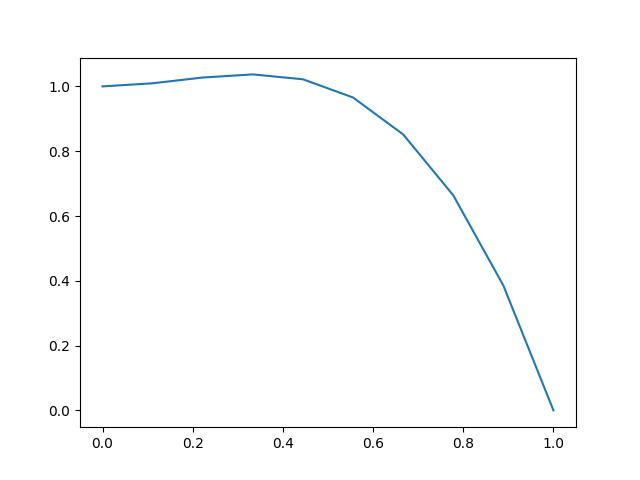
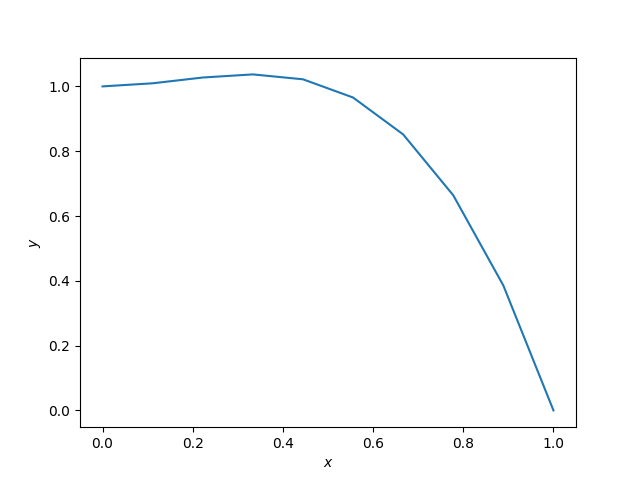

This example shows how to plot a 1D numpy array using 
**matplotlib**.
``` python

import numpy as np
import matplotlib.pyplot as plt

```
Create the array $x$ and define $y$ as the function
$$ y(x) = 1 + x^2 - 2 x^3 $$
``` python
x = np.linspace(0, 1, 10)
y = 1. + x**2 - 2.*x**3

```
To plot the function, firts create the *figure* then use
the *plot* command and *savefig* to save the plot on a
file.
``` python
plt.figure()
plt.plot(x, y)
plt.savefig('plot.png')
plt.show()
plt.close()

```

``` python

```
You can also edit the label of the plot as follow
``` python
plt.figure()
plt.xlabel(r'$x$')
plt.ylabel(r'$y$')
plt.plot(x, y)
plt.savefig('plot2.png')
plt.show()
plt.close()

```

'''